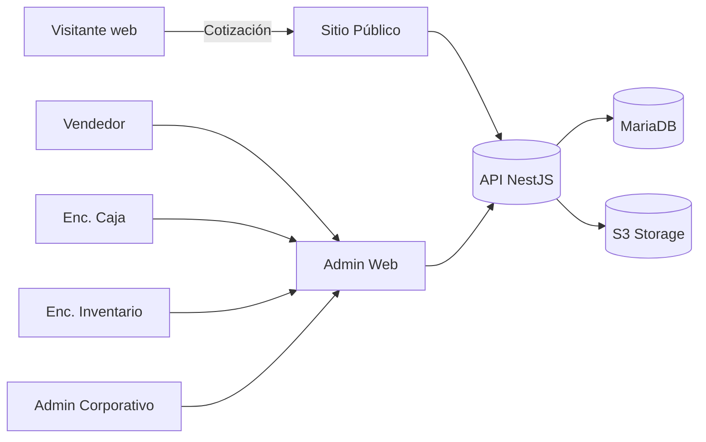

# 07 — Casos de Uso

Formato resumido: actor, precondición, flujo principal, postcondición, reglas asociadas.

## CU-001 — Iniciar sesión
- **Actor:** usuario administrativo.
- **Precondición:** usuario activo.
- **Flujo:** ingresa credenciales → backend valida → emite JWT + refresh → registra evento `login`.
- **Postcondición:** sesión activa; token contiene `user_id`, roles y sedes autorizadas.
- **Reglas:** RB-018.

## CU-010 — Registrar compra centralizada
- **Actor:** admin corporativo / admin de sede principal.
- **Precondición:** proveedor existente; sede principal identificada.
- **Flujo:** crea compra (proveedor, documento, ítems, costos) → estado `BORRADOR` → confirma recepción.
- **Al confirmar (transacción):** genera `movimientos_inventario` tipo `COMPRA` en sede principal, incrementa `inventarios.stock_actual`, recalcula `costo_promedio` (RC-001), fija estado `RECIBIDA`.
- **Postcondición:** inventario de sede principal incrementado; kardex actualizado; auditoría registrada.
- **Reglas:** RB-001, RB-017, RC-001.

## CU-020 — Transferir productos entre sedes
- **Actor:** encargado/admin sede principal (solicita/aprueba/envía), encargado sede destino (recibe).
- **Precondición:** stock suficiente en origen (sede principal).
- **Flujo:**
  1. Solicitar → `SOLICITADA`.
  2. Aprobar → `APROBADA`.
  3. Enviar (transacción): salida en origen (`TRANSFERENCIA_SALIDA`), estado `ENVIADA`.
  4. Recibir (transacción): entrada en destino (`TRANSFERENCIA_ENTRADA`), estado `RECIBIDA`.
- **Alternativas:** cancelar antes de enviar → `CANCELADA` (sin efecto en inventario).
- **Postcondición:** inventario de origen disminuye, de destino aumenta; kardex de ambas sedes.
- **Reglas:** RB-003, RB-004, RB-017, RB-025.

## CU-030 — Registrar venta con productos y servicios
- **Actor:** vendedor.
- **Precondición:** cliente identificado o creado; stock suficiente en la sede de venta para los productos.
- **Flujo:**
  1. Selecciona sede de venta (según acceso), cliente, ítems (productos/servicios/plan), descuentos.
  2. Sistema calcula subtotal, IGV, total (RC-002/003).
  3. Define financiamiento(s): cliente y/o instituciones, Σ = total (RB-021).
  4. Confirma venta (transacción): descuenta stock de productos en sede de venta (`VENTA`), crea `ventas`, `detalle_venta`, `financiamientos`; opcionalmente crea `servicios_contratados`.
- **Postcondición:** venta `CONFIRMADA`; inventario actualizado; CxC generada para financiadores institucionales.
- **Reglas:** RB-005, RB-006, RB-011, RB-021, RB-025, RB-017.

## CU-040 — Registrar pago en efectivo (misma sede)
- **Actor:** encargado de caja / vendedor.
- **Precondición:** venta con financiamiento del cliente pendiente; caja abierta en la sede de cobro.
- **Flujo (transacción):** crea `pago` (financiamiento del cliente, método `EFECTIVO`, destino = caja de la sede de cobro, sede_cobro = sede local) → genera `movimiento_caja` de ingreso → reduce saldo del financiamiento.
- **Postcondición:** saldo del cliente reducido; caja incrementada.
- **Reglas:** RB-008, RB-013, RB-016, RB-022, RB-026, RB-017.

## CU-041 — Registrar pago electrónico (cobro en sede principal)
- **Actor:** vendedor / caja.
- **Precondición:** venta de sede provincial con financiamiento del cliente pendiente.
- **Flujo (transacción):** crea `pago` (método `TRANSFERENCIA`/`POS`/`YAPE`/`PLIN`, destino = cuenta/POS/digital administrado por sede principal, **sede_venta = sede provincial**, **sede_cobro = principal**) → **no** genera movimiento de caja física → reduce saldo del financiamiento.
- **Postcondición:** saldo reducido; registro apto para conciliación futura.
- **Reglas:** RB-007, RB-009, RB-027.

## CU-050 — Venta parcialmente financiada por aseguradora
- **Actor:** vendedor.
- **Precondición:** cliente con cobertura de aseguradora/SIS.
- **Flujo:** venta S/ 5,000 → financiamientos: cliente S/ 3,000, aseguradora S/ 2,000. Cliente paga S/ 3,000 (uno o varios pagos). Aseguradora queda pendiente (CxC S/ 2,000). Posteriormente la aseguradora paga → pago aplicado al financiamiento de la aseguradora → saldo 0.
- **Postcondición:** venta 5,000; financiado 5,000; cobrado 3,000 → luego 5,000; por cobrar 2,000 → luego 0.
- **Reglas:** RB-011..RB-016, RB-022, RB-023.

## CU-060 — Solicitar cotización desde la web
- **Actor:** visitante anónimo.
- **Precondición:** ninguna.
- **Flujo:** completa formulario (datos, servicio/producto/plan, sede preferida, consentimiento) → sistema crea `cotizacion` origen `WEB` estado `SOLICITADA` → notifica al equipo → confirma al solicitante.
- **Postcondición:** cotización registrada y asignable a una sede.
- **Reglas:** RF-080, RNF-091 (consentimiento), rate limiting.

## CU-061 — Atender y convertir cotización en venta
- **Actor:** vendedor / supervisor.
- **Flujo:** asigna cotización a sede → contacta → negocia → si `ACEPTADA`, convierte en venta (CU-030) heredando ítems y cliente.
- **Reglas:** RF-084, RF-085.

## CU-070 — Apertura y cierre de caja
- **Actor:** encargado de caja.
- **Flujo apertura:** registra saldo inicial → `apertura_caja` vigente.
- **Durante:** ingresos/egresos/ventas efectivo/retiros como `movimientos_caja`.
- **Flujo cierre (transacción):** calcula saldo esperado (inicial + ingresos − egresos), registra saldo contado, calcula diferencia, marca apertura `CERRADA`.
- **Reglas:** RB-008, RB-026, RB-017.

## CU-080 — Ajuste de inventario / merma
- **Actor:** encargado de inventario.
- **Flujo:** registra ajuste con tipo (`AJUSTE_ENTRADA`/`AJUSTE_SALIDA`/`MERMA`), cantidad y motivo → genera movimiento y actualiza stock (RB-025).
- **Reglas:** RB-002, RB-020 (motivo, sin borrado).

## CU-090 — Anular venta
- **Actor:** admin de sede / supervisor (con permiso).
- **Precondición:** venta confirmada.
- **Flujo (transacción):** valida política de pagos (si hay pagos, exige registrar devolución o bloquear), revierte inventario (movimiento de reversión), marca venta `ANULADA` con motivo y usuario.
- **Postcondición:** trazabilidad completa; sin eliminación física.
- **Reglas:** RB-020, RB-028, RB-017.

## CU-100 — Consultar reportes consolidados
- **Actor:** admin corporativo.
- **Flujo:** selecciona reporte y rango → sistema agrega datos de todas las sedes autorizadas → exporta.
- **Reglas:** RB-019, RF-132.

## 7.1 Diagrama de contexto (casos principales)

