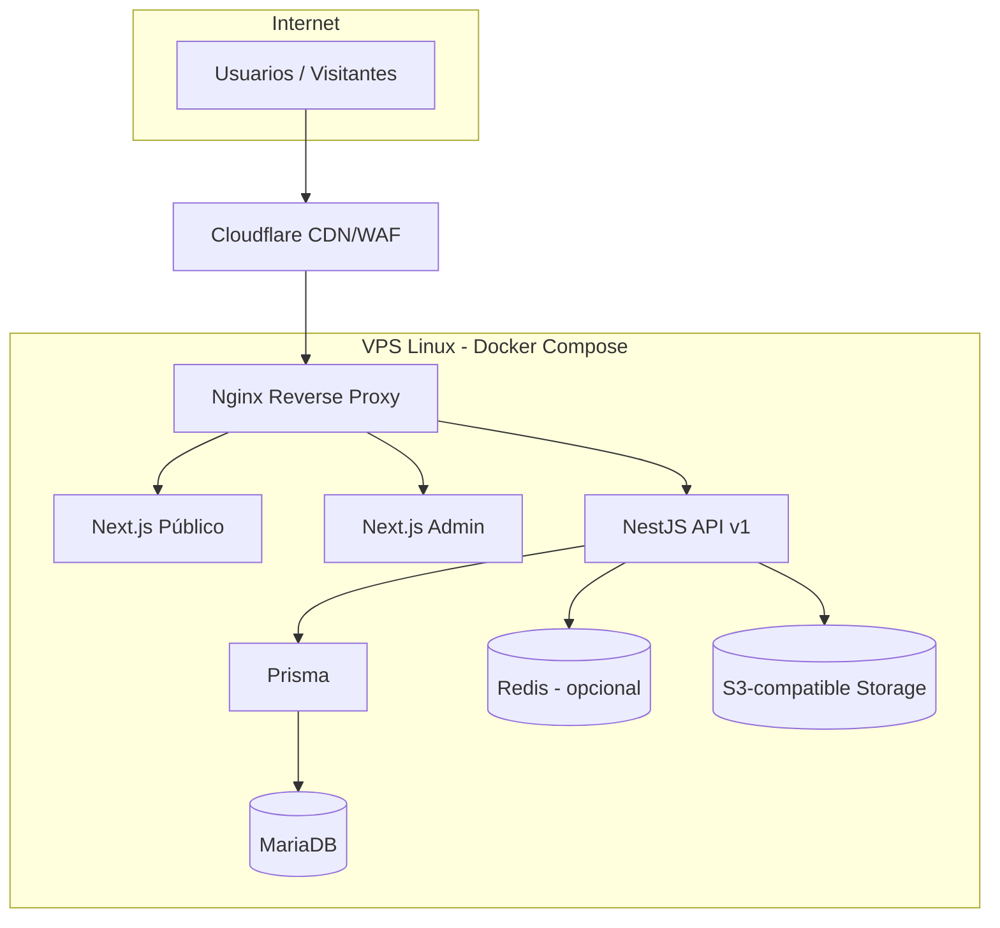
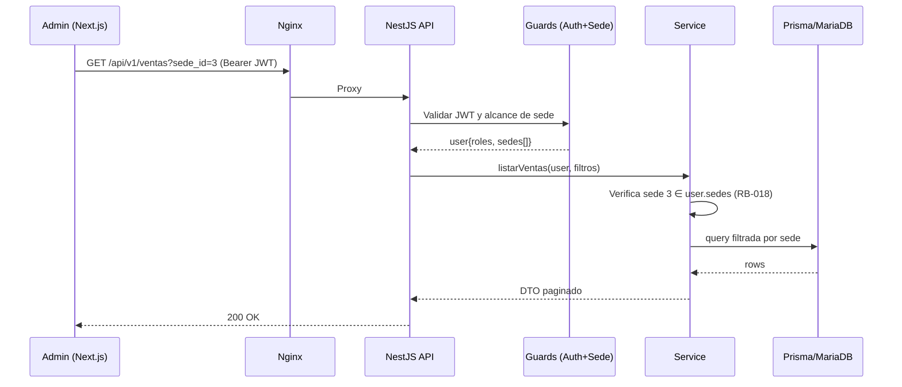
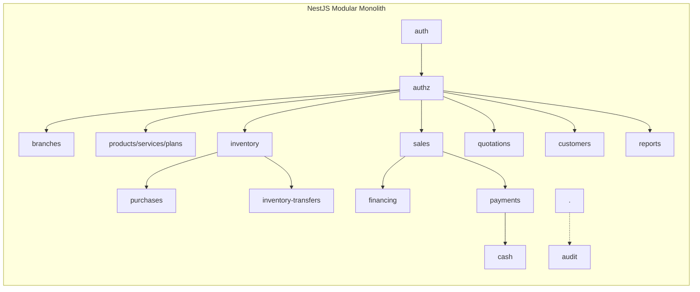

# 08 — Arquitectura General

## 8.1 Estilo arquitectónico

**Monolito modular** (modular monolith) en NestJS. Un único despliegue de backend, internamente dividido en **módulos de dominio** con límites claros. No microservicios (ADR-001). Esto ofrece la mantenibilidad y organización de un diseño por dominios sin el costo operativo de sistemas distribuidos, adecuado para una PYME.

## 8.2 Componentes de alto nivel



## 8.3 Capas del backend (por módulo)

Cada módulo NestJS sigue una arquitectura en capas ligera:

```
Controller (HTTP, DTOs, validación)
    ↓
Service (lógica de negocio, transacciones)
    ↓
Repository / Prisma (acceso a datos)
    ↓
MariaDB
```

- **Controller:** define endpoints REST, aplica `Guards` (auth, roles, sede-scope) y valida DTOs con `class-validator`.
- **Service:** contiene reglas de negocio; orquesta transacciones Prisma (`prisma.$transaction`).
- **Repository:** encapsula consultas Prisma. Para módulos simples, el service puede usar Prisma directamente.
- **Cross-cutting:** interceptores (logging, request-id), filtros de excepción, pipes de validación, guards de autorización.

## 8.4 Módulos transversales (shared)

- `auth` — autenticación y emisión de tokens.
- `authz` — guards y decoradores de autorización por rol y sede.
- `audit` — servicio de auditoría (interceptor + API).
- `common` — DTOs base, paginación, filtros, manejo de errores, utilidades.
- `config` — configuración tipada (env), feature flags (p. ej. `compras_descentralizadas`).
- `storage` — cliente S3.
- `prisma` — módulo Prisma compartido.

## 8.5 Separación de aplicaciones frontend

Dos aplicaciones Next.js **lógicamente independientes**:

- **Público** (`www`): SSR/SSG orientado a SEO y performance, sin autenticación.
- **Admin** (`app`): SPA/SSR autenticada, consume la API con JWT.

Ambas consumen la **misma API** (`api.funeraria-minaya.pe`). El público solo usa endpoints públicos.

## 8.6 Flujo de una petición autenticada



## 8.7 Principios de diseño del backend

1. **Autorización en el servidor** (nunca confiar en filtros del cliente).
2. **Transaccionalidad** en operaciones multi-tabla críticas.
3. **Idempotencia** donde aplique (p. ej. confirmación de recepción de transferencia con clave idempotente).
4. **DTOs de entrada/salida explícitos**; nunca exponer entidades Prisma crudas.
5. **Errores tipados** con formato uniforme (ver [14](14_api.md)).
6. **Feature flags** para reglas configurables (compras descentralizadas, reglas de destino de pago).

## 8.8 Gestión de estado y sesiones

- API **stateless** respecto a autenticación (JWT). El refresh token se persiste (hash) en BD para poder revocar.
- Redis es **opcional** y solo se introduce si se justifica (rate limiting distribuido, cache de catálogos, colas de correo). No es requisito de v1.

## 8.9 Internacionalización y formato

- Backend almacena montos como `DECIMAL(12,2)`, fechas en UTC (`DATETIME`/`TIMESTAMP`), y expone en ISO 8601. El frontend formatea a hora local (America/Lima) y `S/`.

## 8.10 Diagrama de componentes lógicos del backend


