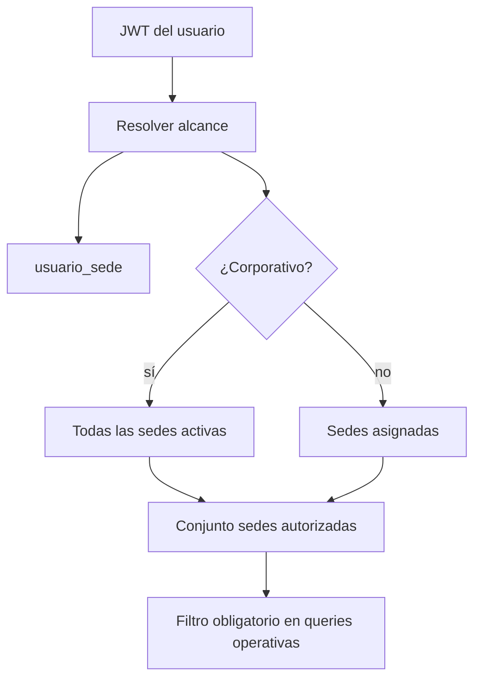

# 09 — Arquitectura Multi-Sede

## 9.1 Principio

El sistema es **multi-sede sobre una base de datos MariaDB única** (ADR-006). No hay una base por sede. Las sedes son entidades independientes dentro de la misma empresa. Agregar una nueva sede es una operación de datos (insertar en `sedes`), sin cambios de arquitectura.

## 9.2 Clasificación de la información

### A. Información corporativa (compartida, sin `sede_id`)
Se define una vez y aplica a toda la empresa:
- `configuracion_empresa` (datos de empresa, IGV, reglas de destino de pago, flags).
- `sedes` (definición de las sedes).
- `usuarios`, `roles`, `permisos`, `rol_permiso`, `usuario_rol`.
- `categorias_producto`, `productos` (catálogo maestro).
- `servicios`, `planes`, `plan_items`.
- `proveedores`.
- `financiadores`.
- `metodos_pago`, `destinos_pago` (catálogos; los destinos referencian una sede administradora).
- `clientes` (compartidos entre sedes; ver 9.6).

### B. Información operativa por sede (con `sede_id` o equivalente)
Pertenece a una sede específica:
- `inventarios` (`sede_id`, `producto_id`).
- `movimientos_inventario` (`sede_id`).
- `sede_servicio` (disponibilidad/precio de servicio por sede).
- `compras` (`sede_id` = sede principal por RB-001).
- `transferencias_inventario` (`sede_origen_id`, `sede_destino_id`).
- `ventas` (`sede_venta_id`).
- `cotizaciones` (`sede_asignada_id`, `sede_preferida_id`).
- `pagos` (`sede_cobro_id`).
- `cajas` (`sede_id`), `aperturas_caja`, `movimientos_caja`.
- `servicios_contratados` (`sede_id`).

## 9.3 Estrategia de aislamiento (tenancy por sede)

**Enfoque elegido: columna discriminadora `sede_id` + autorización en backend** (no esquemas ni bases separadas). Justificación en ADR-006.

- Cada entidad operativa lleva `sede_id` (o `sede_venta_id`/`sede_cobro_id` según el caso).
- El backend calcula el **conjunto de sedes autorizadas** del usuario desde `usuario_sede` (más flag corporativo).
- Toda consulta operativa se filtra por `sede_id ∈ sedes_autorizadas`. Un `SedeScopeGuard`/servicio central inyecta este filtro; **nunca** se confía en un `sede_id` arbitrario del cliente (RB-018).

## 9.4 Relación usuario–sede

Modelo **muchos-a-muchos** con tabla `usuario_sede`. No se usa `usuarios.sede_id` como única solución (limitaría el acceso multi-sede).

- Usuario de una sola sede → una fila en `usuario_sede`.
- Usuario multi-sede → varias filas.
- Usuario corporativo → flag `es_corporativo = true` en `usuarios` (o rol `admin_corporativo` con permiso `sede.acceso_total`), que otorga acceso a todas las sedes activas sin enumerarlas.

`usuario_sede` puede además guardar un rol por sede si el negocio lo requiere (p. ej. `admin_sede` en Caraz y `vendedor` en Yungay). Ver [16](16_seguridad.md) §matriz.

## 9.5 Sede principal

- Identificada por `sedes.is_main = true`.
- **Exactamente una** sede activa con `is_main = true` (RB-024). Se garantiza con:
  - Índice único parcial no es nativo en MariaDB; se implementa con **columna generada** `is_main_flag` que es `1` solo cuando `is_main=true` y `NULL` en otro caso, más `UNIQUE(is_main_flag)`; **o** con validación transaccional en el service. Recomendado: ambas (defensa en profundidad). Ver [10](10_modelo_datos.md) §sedes.
- Rol especial: origen de compras (RB-001) y de la mayoría de destinos electrónicos (RB-009).

## 9.6 Clientes: ¿corporativos o por sede?

**Decisión:** clientes **corporativos** (compartidos). Un mismo cliente puede ser atendido en distintas sedes; duplicarlo por sede fragmentaría su historial. Se mantiene unicidad por documento (RB, RF-071). El historial de ventas del cliente cruza sedes, pero cada venta conserva su `sede_venta_id`. La visibilidad del historial respeta el alcance de sede del usuario que consulta.

## 9.7 Sede de venta vs sede de cobro

Es el eje del modelo (ADR-009):
- `ventas.sede_venta_id` — dónde se realiza la operación comercial.
- `pagos.sede_cobro_id` — dónde/en qué medio se recibe el dinero.
- `destinos_pago.sede_administradora_id` — sede que administra la cuenta/POS/digital.

No existe ninguna restricción que iguale sede de venta y sede de cobro. Los reportes de "ventas por sede" usan `sede_venta_id`; los de "flujo de efectivo/cobros por sede" usan `sede_cobro_id`/`destino`.

## 9.8 Precios por sede

- `servicios.precio_base` (corporativo) con override opcional `sede_servicio.precio`.
- `productos` no tienen precio de venta por sede en v1 (precio de venta corporativo por producto en `productos.precio_venta`), salvo que el negocio lo requiera; el **costo** sí es por sede (`inventarios.costo_promedio`). Si se necesitara precio de venta por sede, se añadiría `sede_producto_precio` sin romper el modelo.

## 9.9 Agregar una nueva sede (procedimiento)

1. Insertar en `sedes` (`is_main=false`).
2. (Opcional) crear su `caja` inicial.
3. Habilitar servicios en `sede_servicio` y precios override si aplica.
4. Asignar usuarios en `usuario_sede`.
5. Abastecerla vía `transferencias_inventario` desde la sede principal.

Ningún paso requiere cambios de esquema ni de arquitectura.
