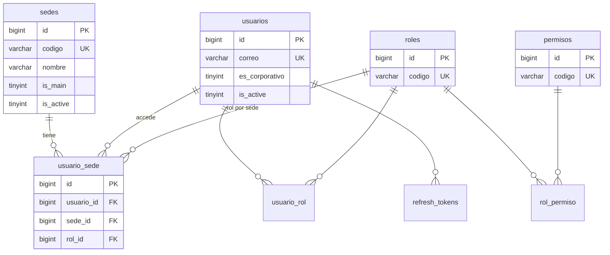
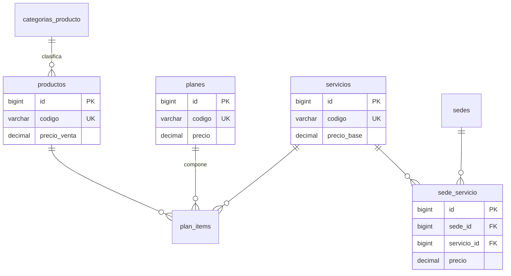
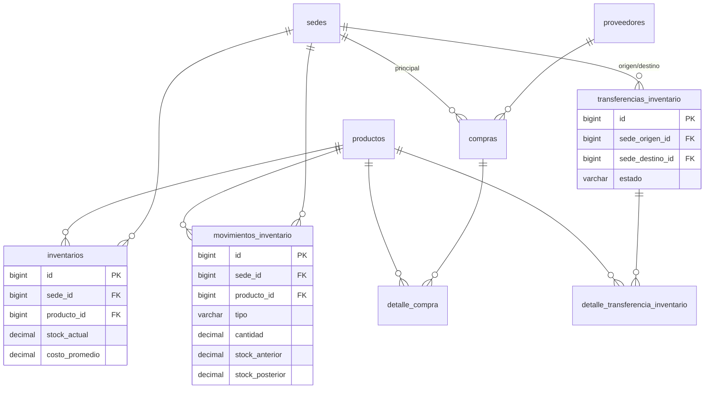
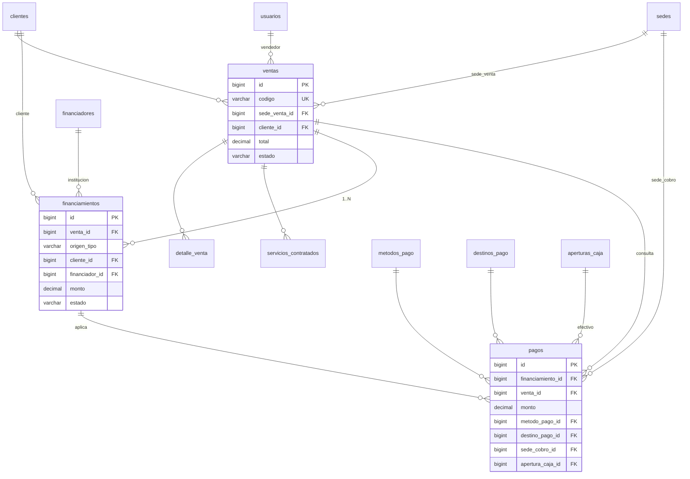
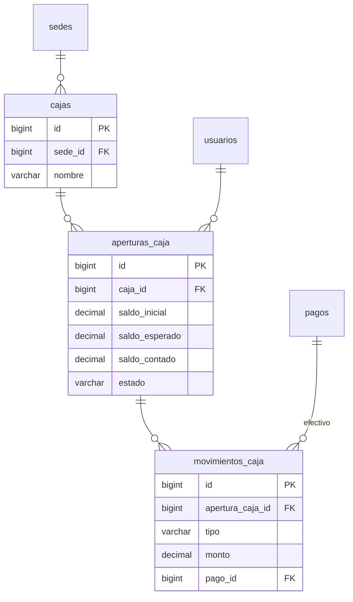
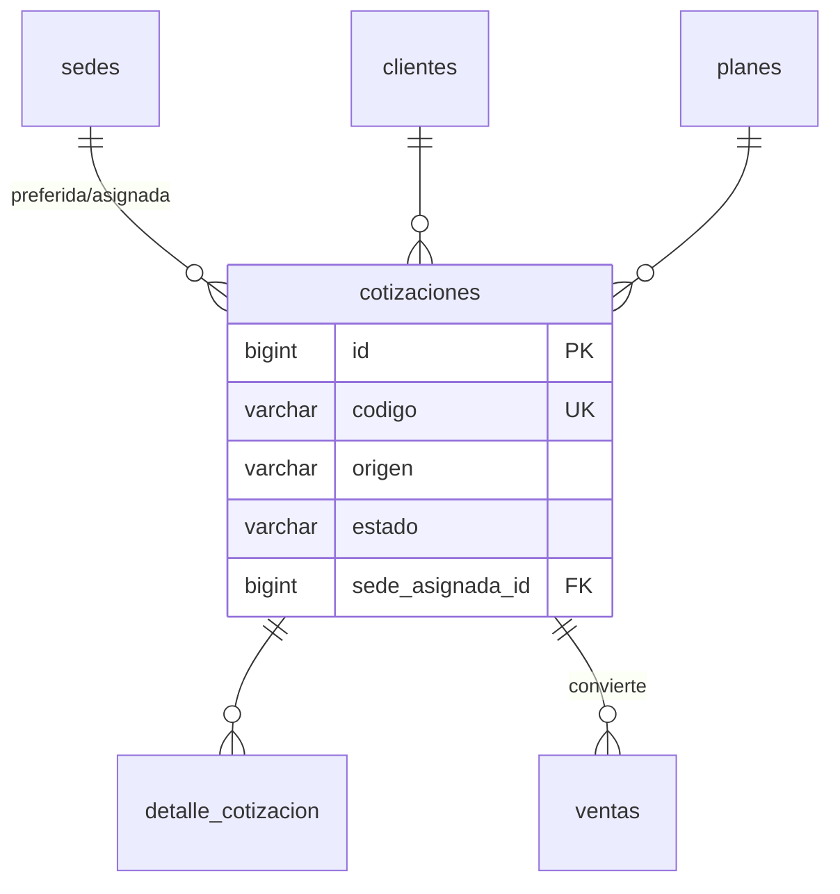

# 12 — Diagrama Entidad-Relación (ERD)

Diagrama lógico. Atributos completos en [10](10_modelo_datos.md). Se muestran claves y relaciones principales.

## 12.1 ERD — Núcleo corporativo y usuarios

## 12.2 ERD — Catálogos

## 12.3 ERD — Inventario, compras y transferencias

## 12.4 ERD — Ventas, financiamiento y pagos (núcleo del negocio)

## 12.5 ERD — Caja

## 12.6 ERD — Cotizaciones

## 12.7 Relaciones clave a recordar

- `ventas.sede_venta_id` ≠ `pagos.sede_cobro_id` (RB-007, ADR-009).
- `pagos.financiamiento_id` conecta el dinero con la obligación (ADR-010).
- `financiamientos` suma = `ventas.total` (RB-021).
- `movimientos_inventario` es la fuente del kardex; `inventarios.stock_actual` es el saldo materializado.
- `destinos_pago.sede_administradora_id` modela dónde "cae" el dinero electrónico (RB-009).
