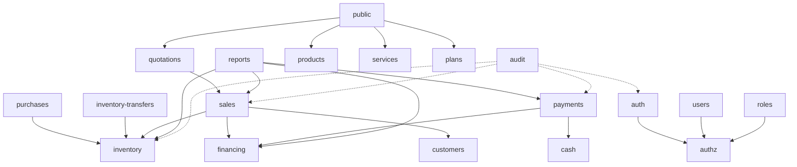

# 13 — Módulos Backend (NestJS)

Monolito modular. Cada módulo agrupa controller(s), service(s), DTOs y (opcional) repositorio. Los módulos comparten `PrismaModule` y `AuthzModule`.

## 13.1 Lista de módulos

| Módulo | Responsabilidad | Tablas principales |
|---|---|---|
| `auth` | Login, refresh, logout, hash de contraseñas | `usuarios`, `refresh_tokens` |
| `authz` | Guards y decoradores de rol y alcance de sede | `roles`, `permisos`, `usuario_sede` |
| `users` | CRUD usuarios, asignación de roles y sedes | `usuarios`, `usuario_rol`, `usuario_sede` |
| `roles` | CRUD roles y permisos, `rol_permiso` | `roles`, `permisos`, `rol_permiso` |
| `branches` | CRUD sedes, gestión de sede principal | `sedes` |
| `customers` | CRUD clientes | `clientes` |
| `products` | Catálogo de productos y categorías | `productos`, `categorias_producto` |
| `services` | Servicios y disponibilidad por sede | `servicios`, `sede_servicio` |
| `plans` | Planes/paquetes y componentes | `planes`, `plan_items` |
| `suppliers` | Proveedores | `proveedores` |
| `purchases` | Compras centralizadas + efecto inventario | `compras`, `detalle_compra` |
| `inventory` | Inventario por sede, movimientos, kardex, ajustes | `inventarios`, `movimientos_inventario` |
| `inventory-transfers` | Transferencias entre sedes | `transferencias_inventario`, `detalle_transferencia_inventario` |
| `sales` | Ventas, detalle, servicios contratados, anulación | `ventas`, `detalle_venta`, `servicios_contratados` |
| `quotations` | Cotizaciones (públicas e internas), conversión a venta | `cotizaciones`, `detalle_cotizacion` |
| `financing` | Financiadores, financiamientos, coberturas, CxC | `financiadores`, `financiamientos` |
| `payments` | Pagos, métodos y destinos | `pagos`, `metodos_pago`, `destinos_pago` |
| `cash` | Cajas, aperturas, movimientos, arqueo | `cajas`, `aperturas_caja`, `movimientos_caja` |
| `reports` | Reportes por sede y consolidados | (lectura agregada) |
| `audit` | Registro y consulta de auditoría | `auditoria` |
| `public` | Endpoints del sitio público (lectura + cotización) | catálogos + `cotizaciones` |
| `storage` | Firma/subida a S3 | — |
| `config` | Configuración de empresa, feature flags | `configuracion_empresa` |

## 13.2 Dependencias entre módulos



Reglas: los módulos operativos dependen de `inventory`/`financing` según su efecto; `audit` es invocado transversalmente vía interceptor y por services en eventos de dominio.

## 13.3 Estructura interna de un módulo (ejemplo `sales`)

```
sales/
  sales.module.ts
  sales.controller.ts
  sales.service.ts
  dto/
    create-sale.dto.ts
    update-sale.dto.ts
    void-sale.dto.ts
    sale-query.dto.ts
  entities/            # tipos de respuesta (no entidades Prisma crudas)
  sales.mapper.ts
  sales.spec.ts        # unit tests
  sales.e2e-spec.ts    # integration/API tests
```

## 13.4 Servicios transversales (providers globales)

- **`PrismaService`** — cliente Prisma; expone `$transaction`.
- **`SedeScopeService`** — resuelve sedes autorizadas del usuario y valida acceso (RB-018).
- **`AuditService`** — `record(action, entity, entityId, data, ctx)`.
- **`CorrelativeService`** — genera códigos de documentos dentro de transacciones.
- **`ConfigService`** (Nest) — expone `configuracion_empresa` y flags.
- **`StorageService`** — URLs prefirmadas S3.

## 13.5 Guards, interceptores y pipes

- `JwtAuthGuard` — valida el access token.
- `RolesGuard` — evalúa `@Roles()`/`@Permissions()`.
- `SedeScopeGuard` — inyecta y valida el alcance de sede sobre parámetros/filtros.
- `AuditInterceptor` — registra acciones marcadas con `@Audit()`.
- `RequestIdInterceptor` — asigna `x-request-id` para correlación de logs.
- `ValidationPipe` global (`whitelist: true`, `forbidNonWhitelisted: true`, `transform: true`).
- `AllExceptionsFilter` — formato de error uniforme (ver [14](14_api.md)).

## 13.6 Decoradores de dominio (ejemplos)

```ts
@Roles('vendedor', 'admin_sede', 'admin_corporativo')
@Permissions('ventas.crear')
@RequireSedeScope('sede_venta_id')   // valida que la sede pertenezca al usuario
@Audit('SALE')
@Post()
create(@CurrentUser() user, @Body() dto: CreateSaleDto) { ... }
```

## 13.7 Transacciones por módulo (resumen)

| Operación | Módulo | Tablas en la transacción |
|---|---|---|
| Recepción de compra | purchases | compras, detalle_compra, inventarios, movimientos_inventario |
| Envío de transferencia | inventory-transfers | transferencias_inventario, inventarios(origen), movimientos_inventario |
| Recepción de transferencia | inventory-transfers | transferencias_inventario, inventarios(destino), movimientos_inventario |
| Confirmar venta | sales | ventas, detalle_venta, inventarios, movimientos_inventario, financiamientos, servicios_contratados |
| Registrar pago efectivo | payments+cash | pagos, movimientos_caja |
| Registrar pago electrónico | payments | pagos |
| Cierre de caja | cash | aperturas_caja |
| Anular venta | sales | ventas, movimientos_inventario, inventarios, (pagos/financiamientos según política) |

## 13.8 Estructura de carpetas del backend

```
apps/api/
  src/
    main.ts
    app.module.ts
    modules/
      auth/ authz/ users/ roles/ branches/ customers/
      products/ services/ plans/ suppliers/
      purchases/ inventory/ inventory-transfers/
      sales/ quotations/ financing/ payments/ cash/
      reports/ audit/ public/ config/
    common/         # DTOs base, paginación, filtros, errores, decoradores
    prisma/         # PrismaService + schema
    storage/
  prisma/
    schema.prisma
    migrations/
    seed.ts
  test/
```
