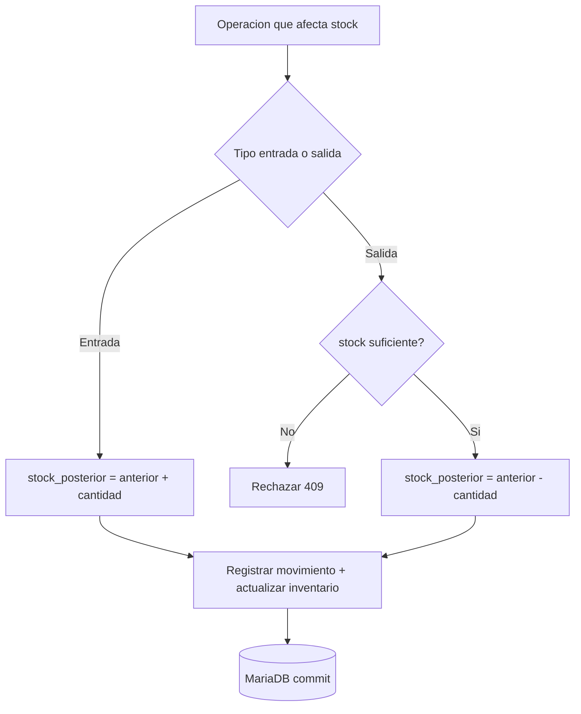

# 18 — Inventario Multi-Sede

## 18.1 Modelo

- **Catálogo maestro** único: `productos` (sin stock).
- **Stock por sede:** `inventarios (sede_id, producto_id)` con `UNIQUE(sede_id, producto_id)` (ADR-008, RB-002).
- **Kardex:** `movimientos_inventario` es la fuente de verdad histórica; `inventarios.stock_actual` es el saldo materializado, siempre consistente con la suma de movimientos.

No se usa `productos.stock`. El "stock global" de un producto es `Σ inventarios.stock_actual` de todas las sedes (consulta derivada).

## 18.2 Tipos de movimiento

| Tipo | Efecto | Origen |
|---|---|---|
| `COMPRA` | + | Recepción de compra (sede principal) |
| `TRANSFERENCIA_ENTRADA` | + | Recepción de transferencia (sede destino) |
| `TRANSFERENCIA_SALIDA` | − | Envío de transferencia (sede origen) |
| `VENTA` | − | Confirmación de venta (sede de venta) |
| `DEVOLUCION` | + | Devolución de cliente |
| `AJUSTE_ENTRADA` | + | Ajuste manual (motivo obligatorio) |
| `AJUSTE_SALIDA` | − | Ajuste manual (motivo obligatorio) |
| `MERMA` | − | Pérdida/deterioro (motivo obligatorio) |
| `ANULACION_VENTA` | + | Reversión por anulación de venta |

Cada movimiento guarda `stock_anterior` y `stock_posterior`, garantizando reconstrucción y auditoría del kardex.

## 18.3 Algoritmo de aplicación de movimiento (transaccional)

```
BEGIN TRANSACTION
  fila = SELECT * FROM inventarios
         WHERE sede_id = :s AND producto_id = :p
         FOR UPDATE            -- bloqueo para evitar carreras (RB-025)
  IF no existe fila:
     crear inventarios(sede, producto, stock_actual=0, costo_promedio=0)
  stock_anterior = fila.stock_actual
  delta = signo(tipo) * cantidad
  stock_posterior = stock_anterior + delta
  IF stock_posterior < 0: ABORT (409 stock insuficiente)   -- RB-025
  UPDATE inventarios SET stock_actual = stock_posterior,
         costo_promedio = recalculo_si_aplica
  INSERT movimientos_inventario(..., stock_anterior, stock_posterior)
COMMIT
```

## 18.4 Costo promedio ponderado

Se recalcula solo en entradas con costo (`COMPRA`, `TRANSFERENCIA_ENTRADA`, `DEVOLUCION` con costo):

```
nuevo_costo = (stock_anterior * costo_promedio + cantidad * costo_unitario)
              / (stock_anterior + cantidad)
```

- En `COMPRA` (sede principal): `costo_unitario` = costo de compra.
- En `TRANSFERENCIA_ENTRADA` (sede destino): `costo_unitario` = costo promedio de la sede origen al momento del envío (se transfiere el costo). El envío no altera el costo promedio del origen.
- En salidas (`VENTA`, `TRANSFERENCIA_SALIDA`, `MERMA`, `AJUSTE_SALIDA`): el costo promedio no cambia.

## 18.5 Stock mínimo/máximo y alertas

- `inventarios.stock_minimo` por sede; alerta cuando `stock_actual <= stock_minimo` (RF-044).
- Reporte "stock bajo" por sede y consolidado.
- Tarea programada opcional para notificar diariamente stock crítico.

## 18.6 Ajustes y mermas

- Requieren permiso `inventario.ajustar` y **motivo obligatorio**.
- Generan movimiento y actualizan stock; nunca modifican el histórico previo (RB-020).

## 18.7 Kardex (reconstrucción)

`GET /inventarios/kardex?sede_id=&producto_id=&desde=&hasta=` devuelve la secuencia de movimientos con saldo corrido. Verificación de integridad: `stock_actual` de `inventarios` == `stock_posterior` del último movimiento.

## 18.8 Reglas y criterios

- **CA-INV-01:** una venta de 3 unidades en Sede Caraz disminuye el inventario de Caraz en 3 y **no** modifica otras sedes.
- **CA-INV-02:** una salida que dejaría stock negativo se rechaza con `409`.
- **CA-INV-03:** el kardex reconstruido coincide con el stock actual.

## 18.9 Diagrama de flujo (movimiento genérico)


