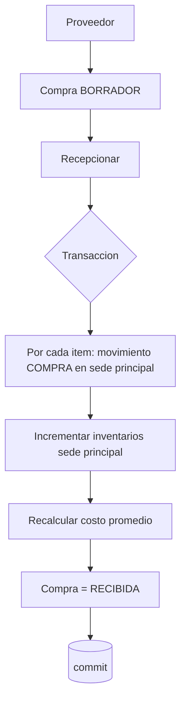
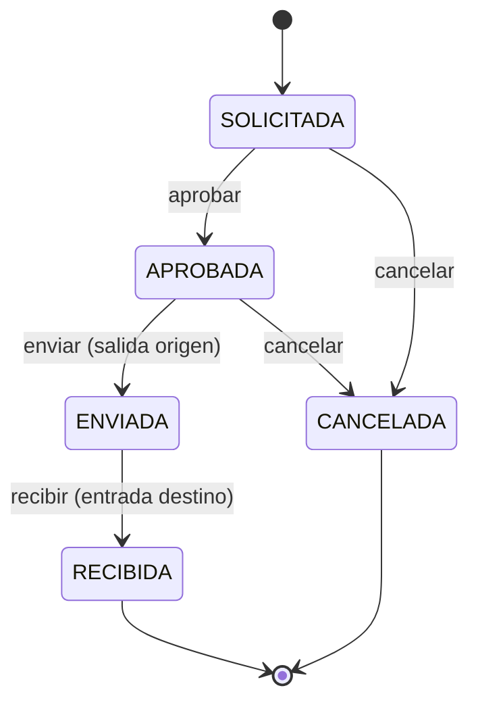
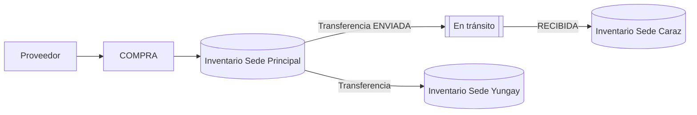

# 19 — Compras y Transferencias

## 19.1 Compras centralizadas (RB-001, ADR-007)

Las compras a proveedores se registran **solo para la sede principal**. El flag `configuracion_empresa.compras_descentralizadas` (default `false`) permite habilitar compras por otras sedes en el futuro sin cambios de esquema.

### Estados de compra
`BORRADOR → RECIBIDA` (o `→ ANULADA`).

- **BORRADOR:** se registran proveedor, documento, ítems, costos; **no** afecta inventario. Editable.
- **RECIBIDA:** se confirma la recepción → efecto en inventario (transacción). No editable.
- **ANULADA:** solo desde BORRADOR, o desde RECIBIDA con reversión controlada y trazabilidad (genera movimientos de reversión).

### Flujo de recepción (transacción)

Reglas:
- Solo `sede_id = principal`.
- Cada línea genera `movimientos_inventario` tipo `COMPRA` con `costo_unitario`.
- Recalcula `costo_promedio` (RC-001, ver [18](18_inventario.md)).
- Registra auditoría `PURCHASE`.

### Datos de compra
Proveedor, fecha, documento, ítems (producto, cantidad, costo, afectación IGV), subtotal, IGV, total, usuario responsable, estado, observaciones.

## 19.2 Transferencias entre sedes (RB-003/004, ADR-013)

La sede principal distribuye a las demás sedes (v1: origen = principal; el modelo soporta cualquier origen→destino).

### Estados
`SOLICITADA → APROBADA → ENVIADA → RECIBIDA`, con `CANCELADA` posible antes de `ENVIADA`.

### Efectos en inventario
- **ENVIADA (transacción):** por cada ítem, movimiento `TRANSFERENCIA_SALIDA` en `sede_origen_id`; valida stock suficiente (RB-025); transfiere el costo promedio (se guarda en el detalle o en el movimiento para aplicarlo en la entrada).
- **RECIBIDA (transacción):** por cada ítem, movimiento `TRANSFERENCIA_ENTRADA` en `sede_destino_id`; incrementa stock y aplica el costo transferido.

Ambas transiciones son transaccionales e idempotentes (Idempotency-Key opcional).

### Reglas
- `sede_origen_id ≠ sede_destino_id` (CHECK).
- No se puede enviar más que el stock disponible en origen.
- Cancelar tras enviar no está permitido (requeriría una transferencia inversa).
- Trazabilidad: usuarios de cada transición y fechas.

### Criterios de aceptación
- **CA-TRF-01:** al enviar, el inventario del origen disminuye en la cantidad transferida.
- **CA-TRF-02:** al recibir, el inventario del destino aumenta en la misma cantidad; el consolidado global se conserva.

## 19.3 Diagrama integrado compra→transferencia→sede

## 19.4 Consideraciones

- **En tránsito:** en v1 el stock sale del origen al enviar y entra al destino al recibir; entre ambos estados la mercancía está "en tránsito" (no aparece en ninguna sede). Si el negocio requiere visibilidad de tránsito, se añadiría un pseudo-almacén de tránsito en el futuro (no en v1, para no sobreingenierizar).
- **Diferencias en recepción:** si se recibe menos de lo enviado, se registra la diferencia como `MERMA`/`AJUSTE` en la sede correspondiente con motivo, manteniendo trazabilidad.
