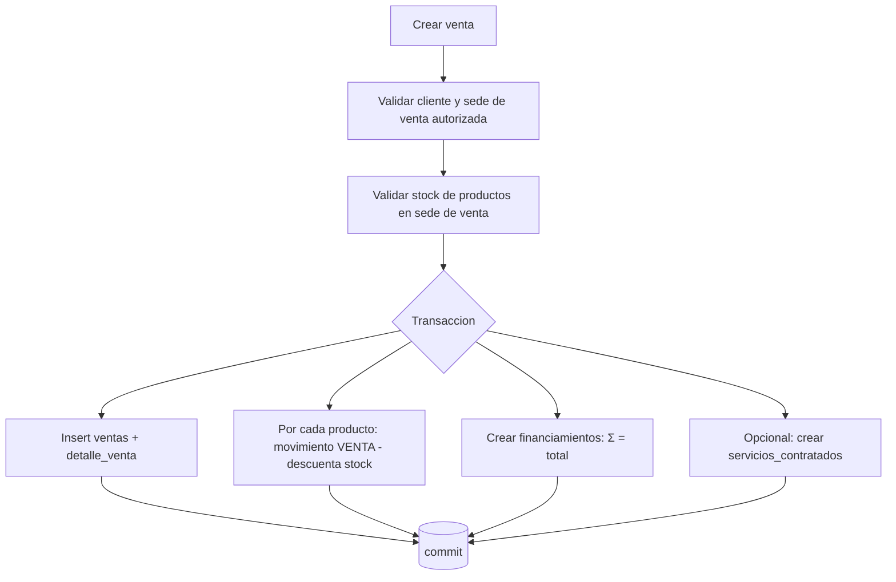

# 20 — Ventas

## 20.1 Concepto

La **venta** representa la operación comercial: qué se vendió y cuánto vale. Está asociada a una **sede de venta** (`sede_venta_id`, RB-006). Puede contener productos, servicios, planes y descuentos.

La venta **no** contiene información de quién paga (eso es financiamiento) ni del dinero recibido (eso es pago). Ver [21](21_financiamiento.md) y [22](22_pagos_cajas.md).

## 20.2 Composición

- `ventas` (cabecera): cliente, vendedor, sede de venta, fecha, subtotal, descuento, base imponible, IGV, total, estado.
- `detalle_venta`: líneas con `item_tipo` (`PRODUCTO`/`SERVICIO`/`PLAN`), snapshot de descripción y precio, cantidad, descuento de línea, afectación IGV, subtotal.

Los precios y descripciones se **snapshotean** en el detalle para preservar el histórico aunque el catálogo cambie después.

## 20.3 Cálculo (RC-002/003)

```
subtotal_linea = cantidad * precio_unitario - descuento_linea
subtotal = Σ subtotal_linea
base_imponible = subtotal - descuento_global (sobre ítems afectos)
igv = base_afecta * igv_porcentaje
total = subtotal - descuento_global + igv
```
Ítems inafectos/exonerados no generan IGV. El sistema guarda `base_imponible`, `igv` y `total`.

## 20.4 Precios

- Producto: `productos.precio_venta` (corporativo).
- Servicio: `sede_servicio.precio` si existe (override por sede, RB-029), si no `servicios.precio_base`.
- Plan: `planes.precio` (precio del paquete). Los componentes se listan como referencia; el precio del plan puede diferir de la suma de componentes (paquete con descuento).

## 20.5 Confirmación de venta (transacción)



Reglas:
- Solo productos afectan inventario (servicios y el "plan" como paquete no descuentan stock, salvo que el plan incluya productos: entonces se descuentan los productos componentes — decisión: al vender un plan con productos, se generan movimientos `VENTA` por cada producto componente).
- Σ `financiamientos.monto` = `ventas.total` (RB-021). Si el cliente asume todo, hay un único financiamiento de origen `CLIENTE`.
- Estado inicial `CONFIRMADA` (o `BORRADOR` opcional si se habilita edición previa).

## 20.6 Servicios contratados (operación funeraria)

**Decisión (ADR / ver [30 del prompt]):** modelar la operación funeraria con una entidad específica `servicios_contratados` **vinculada a la venta**, no dentro del modelo de ventas.

Justificación:
- **Problema:** una venta puede incluir un servicio funerario con datos operativos propios (fecha, lugar, estado operativo, responsable) que no encajan en `detalle_venta` sin contaminarlo.
- **Alternativas:**
  1. Guardar todo en `detalle_venta` con columnas extra → contamina el modelo de ventas y dificulta reportes.
  2. Modelar solo como venta y llevar la operación aparte en documentos → pierde trazabilidad en el sistema.
  3. Entidad `servicios_contratados` 1:N con la venta → separa la operación sin duplicar el modelo comercial.
- **Recomendación:** alternativa 3.
- **Ventajas:** separa operación funeraria de la venta; permite estados operativos (`PROGRAMADO`, `EN_CURSO`, `FINALIZADO`, `CANCELADO`), responsable y agenda; no altera cálculos de venta.
- **Desventaja:** una entidad adicional; asumible.

`servicios_contratados` guarda datos **operativos mínimos** (tipo de servicio, fecha, lugar, estado, responsable, observaciones). No almacena datos sensibles innecesarios (ver [17](17_proteccion_datos.md)).

## 20.7 Anulación de venta (RB-020, RB-028)

- Requiere permiso `ventas.anular` y motivo.
- **Transacción:** genera movimientos `ANULACION_VENTA` (reingresa stock de los productos), marca `ventas.estado='ANULADA'`, registra `anulada_por/at/motivo`.
- **Pagos previos:** no se borran. Si existen pagos confirmados, la anulación exige decisión explícita: registrar **devolución** (movimiento de caja de egreso si fue efectivo, o nota de devolución si fue electrónico) o bloquear la anulación hasta resolver. Los financiamientos se marcan `CANCELADA`.
- Auditoría `SALE_VOID`.

## 20.8 Estado de cuenta de una venta

`GET /ventas/:id/estado-cuenta` retorna:
```
total          = ventas.total
financiado     = Σ financiamientos.monto            (= total si está bien formada)
cobrado        = Σ pagos.monto (CONFIRMADO) por venta
por_cobrar     = financiado - cobrado
por_financiador: [{ nombre, monto, cobrado, pendiente, estado }]
```

## 20.9 Criterios de aceptación

- **CA-SALE-01:** una venta con productos descuenta stock solo de la sede de venta.
- **CA-SALE-02:** la suma de financiamientos iguala el total; no se confirma si no.
- **CA-SALE-03:** anular una venta reingresa el stock y deja trazabilidad sin borrado físico.
