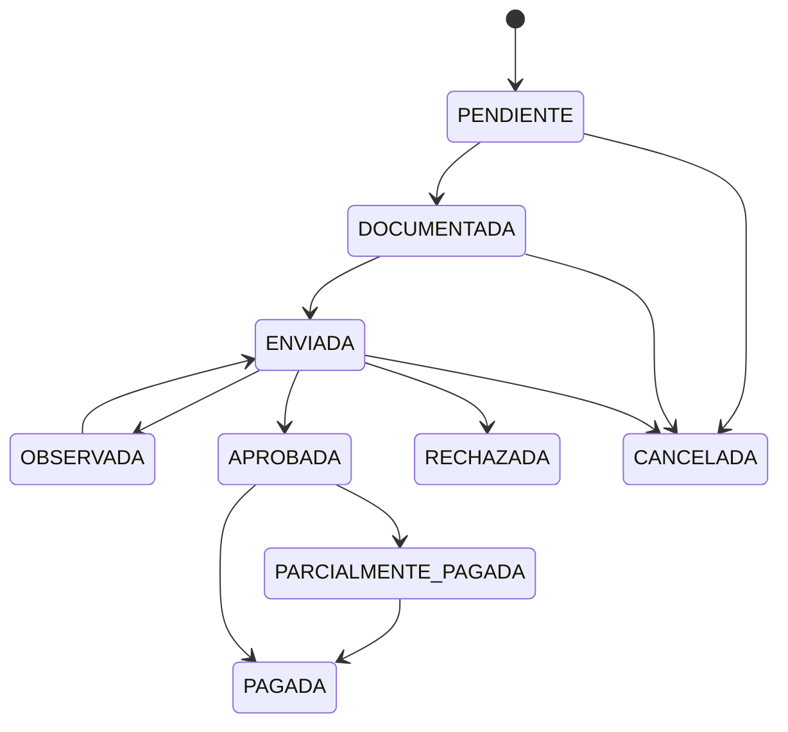

# 21 — Financiamiento y Cuentas por Cobrar

Componente crítico. Separa **quién asume el costo** de una venta (financiamiento) tanto de la venta como del pago (ADR-010, ADR-012).

## 21.1 Conceptos

- **Venta:** operación y monto total.
- **Financiamiento:** una o varias porciones del total, cada una asumida por un financiador (cliente o institución). Σ = total (RB-021).
- **Pago:** dinero recibido, aplicado a un financiamiento específico (ver [22](22_pagos_cajas.md)).

```
VENTA (S/ 5,000)
 ├── financiamiento cliente     = S/ 3,000
 └── financiamiento aseguradora = S/ 2,000
```

## 21.2 Financiadores (RB-012)

Entidad `financiadores`, extensible por `tipo`: `CLIENTE`, `SIS`, `ESSALUD`, `ASEGURADORA`, `INSTITUCION`, `EMPRESA`, `CONVENIO`, `OTRO`.

- SIS, EsSalud y aseguradoras **son financiadores/coberturas, no métodos de pago**.
- El financiamiento del **cliente** referencia `cliente_id` directamente (`origen_tipo='CLIENTE'`); los institucionales referencian `financiador_id` (`origen_tipo='FINANCIADOR'`).

## 21.3 Cobertura (RB-014)

Un financiamiento institucional puede representar una cobertura parcial o total:
- `monto` = porción asumida por el financiador.
- `monto_autorizado` = monto que la institución autoriza (puede diferir; si autoriza menos de lo asignado, el resto vuelve al cliente → se ajustan los financiamientos antes de confirmar/al documentar).
- Datos de cobertura: `numero_poliza`, `documento_cobertura_url`, fechas de solicitud/aprobación/pago.

Ejemplo:
```
Precio servicio = S/ 4,500
Cobertura aseguradora (autorizado) = S/ 2,000
Cliente = S/ 2,500
```

## 21.4 Estados de financiamiento (RB-015)

Ciclo definido:
```
PENDIENTE → DOCUMENTADA → ENVIADA → OBSERVADA? → APROBADA → PARCIALMENTE_PAGADA → PAGADA
                                   → RECHAZADA
cualquier estado → CANCELADA
```



Significado:
- **PENDIENTE:** creado, sin documentar.
- **DOCUMENTADA:** con póliza/documento de cobertura adjunto.
- **ENVIADA:** presentada a la institución.
- **OBSERVADA:** la institución observó; requiere corrección.
- **APROBADA:** autorizada; genera CxC firme.
- **RECHAZADA:** no cubierta; el monto se reasigna (típicamente al cliente).
- **PARCIALMENTE_PAGADA / PAGADA:** según pagos recibidos.
- **CANCELADA:** anulada.

El financiamiento del **cliente** usa un ciclo simplificado: `PENDIENTE → PARCIALMENTE_PAGADA → PAGADA` (no requiere documentación institucional).

## 21.5 Saldo pendiente y cuentas por cobrar (RB-016, RB-023)

Por financiamiento:
```
cobrado = Σ pagos.monto (estado CONFIRMADO) aplicados al financiamiento
saldo_pendiente = monto - cobrado
```
- La **cuenta por cobrar** de un financiador institucional es su `saldo_pendiente > 0` con estado `APROBADA`/`PARCIALMENTE_PAGADA`.
- Reporte CxC por financiador con **antigüedad** (días desde `fecha` de venta o `fecha_aprobacion`), y comparación con `dias_credito`.

```
GET /cuentas-por-cobrar?financiador_id=&sede_id=&antiguedad=
→ [{ financiador, venta, monto, cobrado, pendiente, dias, vencido }]
```

## 21.6 Pago posterior de financiador

Cuando la institución paga (parcial o total), se registra un **pago** aplicado al financiamiento institucional (método TRANSFERENCIA típicamente, destino cuenta principal). Reduce el saldo (RB-016) y actualiza el estado a `PARCIALMENTE_PAGADA`/`PAGADA`.

## 21.7 Ejemplo integral (CU-050)

```
Venta = 5,000
Financiamientos: cliente 3,000 ; aseguradora 2,000
Cliente paga 3,000 → financiamiento cliente = PAGADA
Aseguradora pendiente 2,000 → CxC = 2,000, estado APROBADA
Resultado: total 5,000 | financiado 5,000 | cobrado 3,000 | por cobrar 2,000
Aseguradora paga 2,000 → cobrado 5,000 | por cobrar 0 | aseguradora PAGADA
```

## 21.8 Reglas

- **RB-021:** Σ financiamientos = total de venta (validado al confirmar).
- **RB-022:** Σ pagos de un financiamiento ≤ `monto`.
- **RB-013:** financiamiento y pago independientes.
- **RB-014:** cobertura parcial o total.
- **RB-015/016:** obligación puede quedar pendiente; pagos posteriores la reducen.

## 21.9 Criterios de aceptación

- **CA-FIN-01:** venta 5,000 con cliente 3,000 y aseguradora 2,000 registra ambos financiadores y calcula saldos correctos.
- **CA-FIN-02:** SIS/EsSalud/aseguradora se registran como financiadores, nunca como método de pago.
- **CA-FIN-03:** tras pago del cliente y antes del pago de la aseguradora: cobrado 3,000, por cobrar 2,000.
