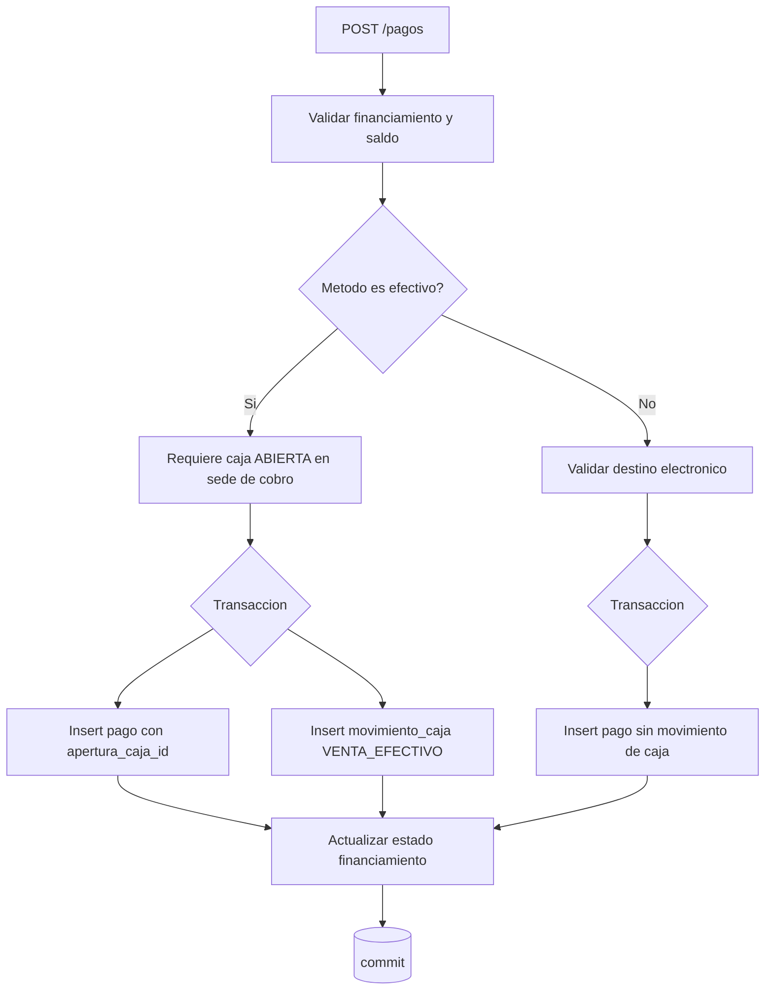
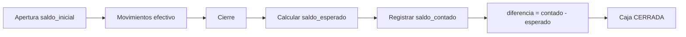

# 22 — Pagos y Cajas

## 22.1 Concepto de pago (ADR-010)

Un **pago** es dinero efectivamente recibido, aplicado a un **financiamiento** específico (define a quién se cobra: cliente o institución). Una venta puede tener múltiples pagos (RB-010).

Cada pago separa dos dimensiones (RB-009/027):
- **Método de pago** (`metodos_pago`): cómo se paga — EFECTIVO, TRANSFERENCIA, POS, YAPE, PLIN, OTROS.
- **Destino del dinero** (`destinos_pago`): dónde cae el dinero — una caja de sede, una cuenta bancaria, un POS, una billetera digital.

Además:
- **Sede de cobro** (`pagos.sede_cobro_id`): dónde se recibió (puede diferir de la sede de venta, RB-007).

## 22.2 Reglas de método ↔ destino (RB-027)

| Método | es_efectivo | Destino requerido | Genera movimiento de caja | Destino por defecto (RB-009) |
|---|:-:|---|:-:|---|
| EFECTIVO | 1 | tipo `CAJA` de la sede de cobro | **Sí** | Caja de la sede de cobro |
| POS | 0 | tipo `POS` | No | POS administrado por sede principal |
| TRANSFERENCIA | 0 | tipo `CUENTA_BANCARIA` | No | Cuenta bancaria principal |
| YAPE / PLIN | 0 | tipo `BILLETERA_DIGITAL` | No | Billetera digital principal |
| OTROS | 0/1 | según configuración | según es_efectivo | configurable |

Las asignaciones por defecto son **configurables** (reglas en `configuracion_empresa` / catálogo `destinos_pago`) para adaptarse si el negocio cambia.

## 22.3 Registro de pago (transacción)



Validaciones:
- `monto > 0` y `Σ pagos del financiamiento + monto ≤ financiamiento.monto` (RB-022).
- Efectivo → destino CAJA de la sede de cobro + `apertura_caja_id` de una caja **ABIERTA** (RB-008, RB-026).
- Electrónico → destino no-CAJA; `apertura_caja_id` NULL (RB-014/pagos electrónicos fuera de caja física, ADR-011).
- Tras el pago, recalcular estado del financiamiento (`PARCIALMENTE_PAGADA`/`PAGADA`).

## 22.4 Ejemplos (RB-007)

- **Efectivo en Caraz:** venta Caraz, pago EFECTIVO, sede_cobro=Caraz, destino=Caja Caraz → movimiento de caja en Caraz.
- **Transferencia de venta de Caraz:** venta sede_venta=Caraz, pago TRANSFERENCIA, sede_cobro=Principal, destino=Cuenta Principal → **sin** movimiento de caja física.
- **POS de venta de Yungay:** venta Yungay, pago POS, destino=POS Principal → sin caja física.

## 22.5 Anulación de pago

- Requiere permiso `pagos.anular` y motivo.
- Marca `estado='ANULADO'` (no borra). Si generó movimiento de caja, registra un movimiento inverso (`EGRESO`/reverso) en la misma apertura si sigue abierta, o deja constancia si ya cerró (con nota para el arqueo). Recalcula el financiamiento.

## 22.6 Cajas (ADR-011)

La caja controla **exclusivamente efectivo**. No es un sistema bancario. Los pagos electrónicos nunca son movimientos de caja física.

### Estructura
- `cajas` (por sede).
- `aperturas_caja` (una sesión ABIERTA a la vez por caja).
- `movimientos_caja` (INGRESO, EGRESO, VENTA_EFECTIVO, RETIRO).

### Apertura
- Registra `saldo_inicial`, usuario y fecha. Estado `ABIERTA`. No se permiten dos aperturas simultáneas de la misma caja (RB-026 + `is_abierta_flag` UNIQUE / validación transaccional).

### Durante la sesión
- Ingresos por ventas en efectivo (vinculados a `pago_id`), otros ingresos, egresos, retiros. Todos con concepto y usuario.

### Cierre / arqueo (transacción)
```
saldo_esperado = saldo_inicial + Σ INGRESOS + Σ VENTA_EFECTIVO - Σ EGRESOS - Σ RETIROS
saldo_contado  = valor ingresado por el encargado
diferencia     = saldo_contado - saldo_esperado
estado = CERRADA ; usuario_cierre, fecha_cierre
```
La diferencia (sobrante/faltante) queda registrada y auditada (`CASH_CLOSE`).



## 22.7 Pagos electrónicos y conciliación futura

Los pagos electrónicos se registran con método, destino, referencia y sede de cobro, dejando los datos listos para una **conciliación** posterior contra estados de cuenta bancarios/POS (fuera del alcance v1, pero soportado por el modelo).

## 22.8 Criterios de aceptación

- **CA-PAY-01:** una venta admite múltiples pagos que suman hasta el total financiado.
- **CA-PAY-02:** un pago POS **no** genera movimiento de caja física.
- **CA-PAY-03:** un pago por transferencia de una venta de Caraz se registra con sede_venta=Caraz y destino=cuenta principal.
- **CA-PAY-04:** un pago en efectivo en Caraz genera un movimiento en la caja de Caraz y requiere caja abierta.
- **CA-CASH-01:** no se puede registrar efectivo sin caja abierta; el arqueo calcula la diferencia correctamente.
