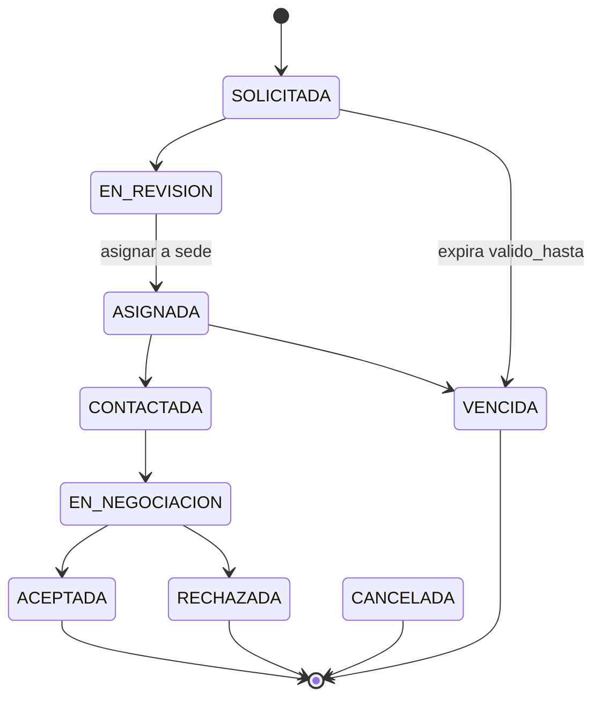
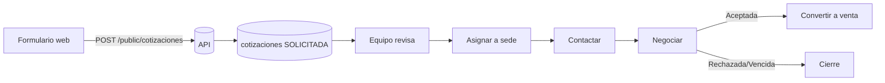

# 23 — Cotizaciones

## 23.1 Concepto

Una cotización captura una solicitud de servicio/producto/plan antes de convertirse en venta. Puede originarse desde el sitio público o registrarse internamente.

## 23.2 Orígenes

`WEB`, `WHATSAPP`, `TELEFONO`, `PRESENCIAL`, `OTRO`.

- **WEB:** creada por el visitante en el sitio público (endpoint público con rate limit + captcha + consentimiento de datos).
- Otros orígenes: registrados por usuarios del admin.

## 23.3 Estados

`SOLICITADA → EN_REVISION → ASIGNADA → CONTACTADA → EN_NEGOCIACION → ACEPTADA` (o `RECHAZADA` / `VENCIDA` / `CANCELADA`).

## 23.4 Contenido

- Datos del solicitante (nombres, teléfono, correo).
- Cliente vinculado (si ya existe).
- Ítems: productos y/o servicios (`detalle_cotizacion`), o un plan.
- Sede preferida y sede asignada.
- Observaciones, fecha, validez (`valido_hasta`), consentimiento de datos.
- Usuario asignado.

## 23.5 Asignación a sede (RB-018 / RF-084)

Una cotización web se asigna a una sede para su atención (`sede_asignada_id`), lo que la hace visible para los usuarios de esa sede. Los administradores corporativos ven todas.

## 23.6 Conversión a venta (RF-085)

Desde una cotización `ACEPTADA`, un vendedor la convierte en venta (`POST /cotizaciones/:id/convertir-venta`), heredando cliente e ítems. La venta guarda `cotizacion_id` como trazabilidad. La cotización pasa a estado final `ACEPTADA` (convertida).

## 23.7 Vencimiento (RF-086)

Tarea programada diaria marca `VENCIDA` las cotizaciones con `valido_hasta < hoy` en estados no finales.

## 23.8 Sitio público — formulario

- Validación server-side, rate limiting, captcha.
- Consentimiento explícito (Ley 29733, ver [17](17_proteccion_datos.md)).
- Confirmación al solicitante (correo opcional) y notificación interna.
- No expone información sensible ni permite enumerar cotizaciones existentes.

## 23.9 Diagrama de flujo web → atención

## 23.10 Criterios de aceptación

- **CA-QUO-01:** una cotización web se crea con origen WEB, estado SOLICITADA y consentimiento registrado.
- **CA-QUO-02:** una cotización aceptada se convierte en venta heredando cliente e ítems, con `cotizacion_id` en la venta.
- **CA-QUO-03:** una cotización vencida cambia a VENCIDA por la tarea programada.
