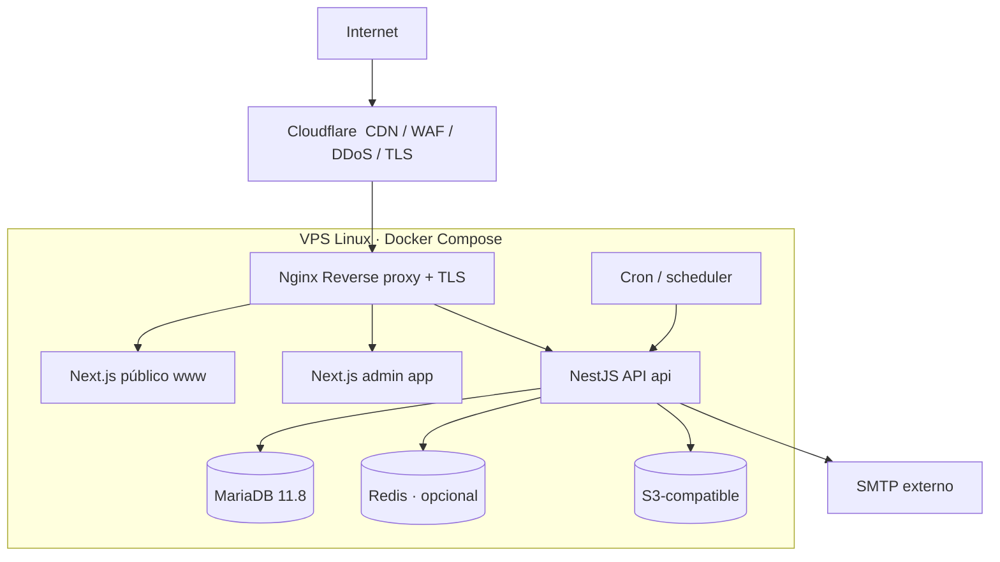

# 26 — Infraestructura

> **Entornos y Docker.** Docker/Docker Compose es la estrategia de despliegue en **servidor** (staging/producción). El **desarrollo local** corre con **servicios nativos** (sin Docker) — ver §26.10. La topología de abajo describe el servidor.

## 26.1 Topología



## 26.2 Dominios y enrutamiento (Nginx)

- `www.funeraria-minaya.pe` → contenedor Next.js público.
- `app.funeraria-minaya.pe` → contenedor Next.js admin.
- `api.funeraria-minaya.pe` → contenedor NestJS.

Nginx: TLS (o TLS terminado en Cloudflare con "Full Strict"), gzip/brotli, cabeceras de seguridad, proxy_pass, límites de tamaño de body, timeouts razonables. Cloudflare aporta CDN para el sitio público y WAF/rate limiting perimetral.

## 26.3 VPS objetivo

- **4 vCPU / 8 GB RAM / 80–160 GB SSD/NVMe** (RNF-020).
- Ubuntu LTS. Firewall (ufw) permitiendo solo 80/443 (y 22 restringido). Fail2ban para SSH.
- Docker + Docker Compose.

## 26.4 Distribución de recursos (orientativa)

| Servicio | RAM aprox. | Notas |
|---|---|---|
| MariaDB | 2–3 GB | `innodb_buffer_pool_size` ~50–60% de su cuota |
| NestJS API | 1–1.5 GB | 1–2 réplicas si se requiere |
| Next.js público | 0.5–1 GB | mayormente estático/ISR |
| Next.js admin | 0.5–1 GB | |
| Nginx | 128 MB | |
| Redis (opcional) | 256–512 MB | solo si se justifica |
| Sistema/holgura | ~1 GB | |

## 26.5 Escalabilidad

- **Vertical:** aumentar vCPU/RAM del VPS y del contenedor MariaDB (buffer pool). Primera palanca para una PYME.
- **Horizontal (futuro):**
  - API NestJS es **stateless** (JWT + BD) → múltiples réplicas tras Nginx (load balancing round-robin).
  - Sitio público → CDN/Cloudflare + ISR; fácilmente escalable.
  - MariaDB → réplica de solo lectura para reportes pesados; particionar por fecha si crece mucho (no necesario en v1).
  - Almacenamiento → S3 gestionado externamente, escala independiente.

## 26.6 Entornos

| Entorno | Propósito | Infra |
|---|---|---|
| Desarrollo | local | Docker Compose local, BD de prueba |
| Staging | validación | VPS pequeño o mismo VPS con stack aislado |
| Producción | operación | VPS objetivo |

Variables por entorno vía archivos `.env` no versionados / secretos.

## 26.7 Red y seguridad de infraestructura

- Contenedores en red Docker interna; solo Nginx expone puertos públicos.
- MariaDB **no** expuesto a internet (solo red interna Docker).
- TLS obligatorio; HSTS.
- Backups y almacenamiento con acceso restringido (ver [30](30_backups.md)).

## 26.8 DNS

- Registros A/AAAA de los tres subdominios apuntando (vía Cloudflare) al VPS.
- Si el dominio definitivo no está disponible, usar los ejemplos como placeholders y parametrizar por variable de entorno.

## 26.9 No hacer (recordatorio)

- ❌ Kubernetes, microservicios, bases por sede.
- ❌ Exponer MariaDB públicamente.
- ❌ Introducir Redis sin necesidad justificada.

## 26.10 Entorno de desarrollo local (Windows, sin Docker)

En desarrollo, Docker **no** se usa (es pesado en Windows). Los servicios corren de forma **nativa**; Docker queda reservado para servidor.

| Componente | Servidor (prod/staging) | Desarrollo local (Windows) |
|---|---|---|
| Orquestación | Docker Compose | Procesos nativos (`pnpm dev`) |
| MariaDB | Contenedor `mariadb:11.8` | **MariaDB 11.8 nativa** (instalador/winget), solo `localhost` |
| Node | Imagen Node en contenedor | Node LTS nativo |
| Redis (opcional) | Contenedor (si se usa) | Omitir salvo que se necesite |
| Reverse proxy | Nginx + Cloudflare | No necesario; apps en sus puertos (`3000/3000/3001`) |
| Almacenamiento | S3-compatible | S3 real de dev **o** carpeta local simulada |

**Levantar el entorno local:**
1. Instalar MariaDB 11.8 y Node LTS (mismas versiones mayores que producción — ver §26.11).
2. Crear BD local y usuario; configurar `DATABASE_URL` en `.env` (no versionado).
3. `pnpm install` en la raíz del monorepo.
4. `pnpm prisma migrate dev` + `pnpm prisma db seed`.
5. Arrancar API y frontends en paralelo (`pnpm dev`).

El `docker-compose.yml` permanece en el repo como artefacto de **despliegue**, no se ejecuta en el día a día local.

**Troubleshooting — `apps/admin` (Next.js + Turbopack) se cuelga en "Rendering..." al navegar entre menús:**
El escaneo en tiempo real de **Windows Defender** sobre la carpeta del repo (en particular los symlinks de `node_modules/.pnpm` y la caché `.next` de Turbopack) puede causar cuelgues intermitentes del dev server — la petición de navegación (RSC) nunca llega a completarse y, por tanto, tampoco se ve la petición correspondiente en la consola de `apps/api`. Solución: excluir la carpeta del repo del escaneo en tiempo real (PowerShell como administrador):

```powershell
Add-MpPreference -ExclusionPath "D:\ruta\al\repo\funeraria-minaya"
```

Reiniciar `pnpm dev` después de aplicar la exclusión.

## 26.11 Paridad dev/prod

Riesgo: desarrollar sin contenedores puede ocultar diferencias de versión ("en mi máquina funciona"). Mitigación:

- Fijar y documentar las **versiones mayores** idénticas en local y en las imágenes del servidor: **MariaDB 11.8 LTS** y **Node LTS** (misma línea).
- Fijar el gestor de paquetes con `packageManager` en `package.json` (pnpm@x.y.z) y `engines` de Node.
- Validar en CI contra MariaDB 11.8 (servicio del runner) antes de desplegar.
- Antes de cada release, prueba de humo del build Docker en staging.
