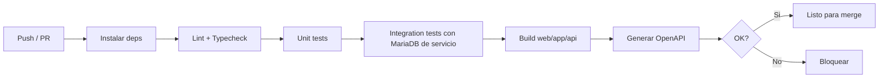

# 28 — CI/CD

## 28.1 Objetivo

Despliegue **reproducible** y simple, adecuado a una PYME. Herramienta recomendada: **GitHub Actions** (alternativa: GitLab CI). Decisión final según dónde se aloje el repositorio.

> **Gestor de paquetes:** **pnpm** (con `pnpm-lock.yaml`). En CI: `corepack enable` + `pnpm install --frozen-lockfile`, con caché del store de pnpm.
> **Entornos:** el desarrollo **local** usa servicios **nativos** en Windows (sin Docker); Docker se construye/despliega solo en staging/producción (ver [26](26_infraestructura.md) §26.10, [27](27_docker.md)). El runner de CI usa MariaDB 11.8 como servicio, independientemente de eso.

## 28.2 Estrategia de ramas

- `main` → producción (protegida; merge por PR).
- `develop` → integración/staging.
- `feature/*` → desarrollo.
- Tags `vX.Y.Z` para releases.

## 28.3 Pipeline de integración (en cada PR)

Pasos:
1. `corepack enable` + `pnpm install --frozen-lockfile` (con caché del store de pnpm).
2. `lint` (ESLint) + `typecheck` (tsc).
3. `test:unit`.
4. `test:integration` (levanta MariaDB como servicio del runner; ejecuta `prisma migrate deploy` sobre BD efímera).
5. Build de las tres apps.
6. Exportar `openapi.json` como artefacto.

## 28.4 Pipeline de despliegue

### Staging (al mergear a `develop`)
- Build de imágenes Docker → push a registry (GHCR o el del proveedor).
- Deploy a staging: `docker compose pull && docker compose up -d` vía SSH; `prisma migrate deploy`.
- Smoke tests (health checks + endpoints clave).

### Producción (al taggear release en `main`)
- Aprobación manual (environment protegido).
- Build/push de imágenes con tag de versión.
- Deploy por SSH al VPS: `docker compose pull` + `up -d` con la nueva versión; migraciones `deploy`.
- Verificación post-deploy (health, versión, smoke).
- **Rollback:** volver al tag anterior (`docker compose up -d` con la imagen previa). Las migraciones deben ser compatibles hacia atrás cuando sea posible (evitar cambios destructivos en un solo release; usar expand/contract).

## 28.5 Migraciones seguras

- Estrategia **expand/contract**: primero añadir columnas/estructuras (compatibles), desplegar código, luego (en release posterior) limpiar. Evita romper si hay rollback.
- Nunca ejecutar `migrate reset` en producción.

## 28.6 Secretos en CI

- Guardados como secrets del repositorio/entorno (no en el código).
- Claves SSH de despliegue, credenciales de registry, tokens.

## 28.7 Calidad como puerta

- PR no mergeable si fallan lint, typecheck o tests.
- Cobertura mínima en dominios críticos (ver [29](29_testing.md)) como check informativo/bloqueante según madurez del equipo.

## 28.8 Versionado y changelog

- SemVer en tags. Changelog generado a partir de PRs/commits (convención de commits recomendada).

## 28.9 Simplicidad

- Un solo workflow por app o un workflow monorepo con jobs por app y `paths` para builds selectivos.
- Sin orquestadores externos; el VPS ejecuta Compose. Reproducibilidad mediante imágenes versionadas + migraciones idempotentes.
