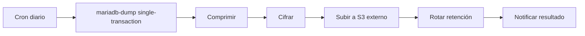

# 30 — Backups y Recuperación

## 30.1 Objetivos (RPO/RTO)

Para una PYME:
- **RPO objetivo:** ≤ 24 h con backup diario completo. Mejorable a ≤ 1 h activando **binlog** de MariaDB (point-in-time recovery) si el negocio lo requiere.
- **RTO objetivo:** ≤ 4 h para restaurar completamente en el mismo VPS.

## 30.2 Alcance del respaldo

1. **Base de datos MariaDB** (crítico).
2. **Archivos en S3** (documentos, comprobantes, imágenes de coberturas): respaldados por versionado del bucket y/o copia a un bucket secundario.
3. **Configuración e infraestructura**: `docker-compose`, configs de Nginx, `.env.example`, migraciones — versionadas en el repositorio.

## 30.3 Estrategia MariaDB

- **Backup lógico diario:** `mariadb-dump --single-transaction --routines --triggers` (alias de `mysqldump`) (consistente sin bloquear InnoDB), comprimido (`gzip`) y **cifrado** antes de subir.
- **Point-in-time (opcional):** habilitar binlog; respaldar binlogs incrementales cada 15–60 min para RPO bajo.
- **Frecuencia:** diario completo (madrugada) + retención escalonada.

## 30.4 Retención (esquema recomendado)

| Tipo | Frecuencia | Retención |
|---|---|---|
| Completo diario | 1/día | 7 días |
| Completo semanal | 1/semana | 4 semanas |
| Completo mensual | 1/mes | 6–12 meses |
| Binlog (si se usa) | continuo | hasta el siguiente full + margen |

## 30.5 Almacenamiento de backups

- Copia **fuera del VPS**: subir los dumps cifrados a S3 (bucket dedicado con acceso restringido) o a otro proveedor. Nunca depender solo del volumen local.
- Cifrado en reposo; llaves gestionadas fuera del repositorio.

## 30.6 Automatización

- Job programado (cron en host o contenedor de backup) que ejecuta dump → comprime → cifra → sube → rota antiguos → registra resultado.
- Notificación de éxito/fallo (correo/webhook). Un fallo de backup es un incidente.

## 30.7 Restauración

Procedimiento documentado y **probado**:
1. Aprovisionar/limpiar instancia MariaDB objetivo.
2. Descargar y descifrar el dump requerido.
3. `mariadb < dump.sql` (o restaurar full + aplicar binlogs hasta el punto deseado).
4. Verificar integridad (conteos, checks de consistencia clave: stock vs kardex, Σ financiamientos vs total).
5. Reapuntar la API (`DATABASE_URL`) y validar con smoke tests.

## 30.8 Pruebas de recuperación

- **Restore drill trimestral:** restaurar en un entorno aislado y validar. Registrar tiempo (para verificar RTO) y resultado.
- Verificar que los backups no estén corruptos (restauración de muestra).

## 30.9 Consistencia con reglas de negocio

- La restauración no debe romper la relación kardex↔stock ni financiamiento↔pagos. Incluir en la validación post-restore las verificaciones del checklist ([36](36_criterios_aceptacion.md)).

## 30.10 Responsabilidades

- Definir responsable de backups y de la prueba de restauración.
- Documentar contactos y pasos en un runbook accesible al equipo.
