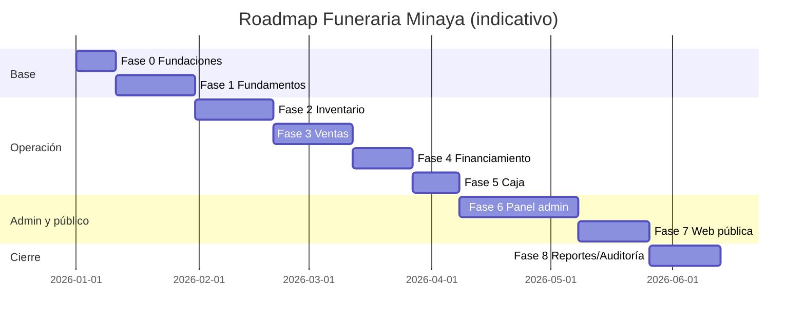

# 33 — Roadmap

Fases ordenadas por dependencias. Cada fase entrega valor y deja base para la siguiente.

## Fase 0 — Fundaciones técnicas
- Monorepo, tooling (ESLint/Prettier/TS), Docker Compose local.
- Prisma + esquema base + migraciones iniciales + seed (empresa, sede principal, roles/permisos, métodos de pago).
- Esqueleto NestJS (módulos vacíos, guards, config, health).
- CI básico (lint, typecheck, test, build).

## Fase 1 — Fundamentos (negocio base)
- `auth` (JWT + refresh), `users`, `roles`/`permisos`, `authz` (RBAC + alcance de sede).
- `branches` (sedes, sede principal).
- `products`, `services` (+ disponibilidad/precio por sede), `plans`.
- `customers`.
- **Salida:** login, gestión de usuarios/sedes/catálogos/clientes con seguridad multi-sede.
- **Verifica:** CA-SEC-01.

## Fase 2 — Inventario
- `inventory` (inventarios, movimientos, kardex, ajustes, stock bajo).
- `purchases` (compras centralizadas + efecto inventario).
- `inventory-transfers` (transferencias con estados y doble movimiento).
- **Salida:** control de stock por sede, compras y distribución.
- **Verifica:** CA-INV-01..03, CA-TRF-01..02.

## Fase 3 — Ventas
- `quotations` (internas) → conversión a venta.
- `sales` (venta, detalle, servicios contratados, anulación) con descuento de stock.
- `payments` (registro básico de pagos del cliente; métodos/destinos).
- **Salida:** ciclo de venta y cobro del cliente.
- **Verifica:** CA-SALE-01..03, CA-PAY-01.

## Fase 4 — Financiamiento
- `financing` (financiadores, financiamientos, coberturas, estados).
- Cuentas por cobrar y pagos posteriores de instituciones.
- **Salida:** ventas con múltiples financiadores y gestión de CxC.
- **Verifica:** CA-FIN-01..03, CA-PAY-02..03.

## Fase 5 — Caja
- `cash` (cajas, apertura, movimientos, cierre/arqueo).
- Integración pago efectivo ↔ caja; validación de caja abierta.
- **Salida:** control de efectivo por sede con arqueo.
- **Verifica:** CA-PAY-04, CA-CASH-01.

## Fase 6 — Panel de administración (frontend)
- App `apps/admin` (Next.js SPA autenticada, `docs/15_frontend.md` + skill `funeraria-design`).
- Construida módulo por módulo espejando el backend de las Fases 1–5, no como una fase que espera a que todo el backend termine: cada sub-fase inicia en cuanto su backend espejo está listo.
- **Sub-fases (trazabilidad):**
  - **6.A — Fundamentos**: login, cambio de contraseña forzado, shell (sidebar/topbar), componentes base (tabla, modal, formularios, toasts).
  - **6.B — Sedes, usuarios y catálogos** (espeja Fase 1): 6.B.1 Sedes · 6.B.2 Usuarios y roles · 6.B.3 Catálogos (productos/servicios/planes/proveedores) · 6.B.4 Clientes.
  - **6.C — Inventario** (espeja Fase 2): 6.C.1 Inventario (kardex, ajustes, stock bajo) · 6.C.2 Compras · 6.C.3 Transferencias entre sedes.
  - **6.D — Ventas y caja** (espeja Fases 3–5): 6.D.1 Ventas · 6.D.2 Pagos · 6.D.3 Financiamiento y cuentas por cobrar · 6.D.4 Caja.
  - **6.E — Cotizaciones** (espeja `quotations` de Fase 3): listado, ciclo de estados, asignación a sede, conversión a venta.
- **Salida:** operación diaria completa desde el panel admin para todo lo entregado en las Fases 1–5.
- **Verifica:** CA-SEC-01, CA-INV-01..03, CA-TRF-01..02, CA-SALE-01..03, CA-PAY-01..04, CA-FIN-01..03, CA-CASH-01.
- **Pendiente en el panel:** Reportes y Auditoría (Fase 8) — sin backend propio todavía, no se construyen antes de tiempo.

## Fase 7 — Web pública
- Sitio Next.js público: servicios, productos, planes, promociones, sedes, contacto, FAQ.
- Formulario de cotización (origen WEB) + WhatsApp + consentimiento.
- SEO y performance.
- **Salida:** captación pública y cotizaciones web integradas al admin.
- **Verifica:** CA-QUO-01, CA-SEO-01..03.

## Fase 8 — Reportes, auditoría y optimización
- `reports` por sede y consolidados; exportaciones.
- `audit` completo (interceptor + consulta).
- Observabilidad, backups automatizados, endurecimiento de seguridad.
- Optimización de índices/consultas.
- **Salida:** operación completa, auditable y monitoreada.
- **Verifica:** CA-REP-01..03, CA-AUD-01..02.

## Cronograma indicativo

> Los tiempos son orientativos y deben ajustarse al equipo real. El orden de dependencias (auth→sedes→catálogos→inventario→ventas→financiamiento→caja→admin→web→reportes) sí es recomendado mantenerlo.

## Ajustes de dependencia

- `payments` se inicia en Fase 3 (pagos del cliente) y se completa en Fase 4 (pagos institucionales) y Fase 5 (integración con caja). Es un módulo que madura en tres fases.
- El panel de administración (Fase 6) es transversal a las Fases 1–5: cada sub-fase se apoya en el backend de su fase espejo (6.B→Fase 1, 6.C→Fase 2, 6.D→Fases 3–5, 6.E→`quotations` de Fase 3) y puede iniciar en cuanto ese backend esté listo, sin esperar a que termine todo el backend.
- La web pública (Fase 7) depende de catálogos (Fase 1) y cotizaciones (base en Fase 3).
